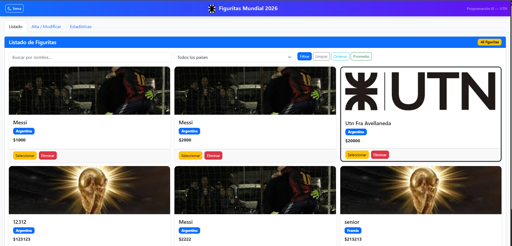
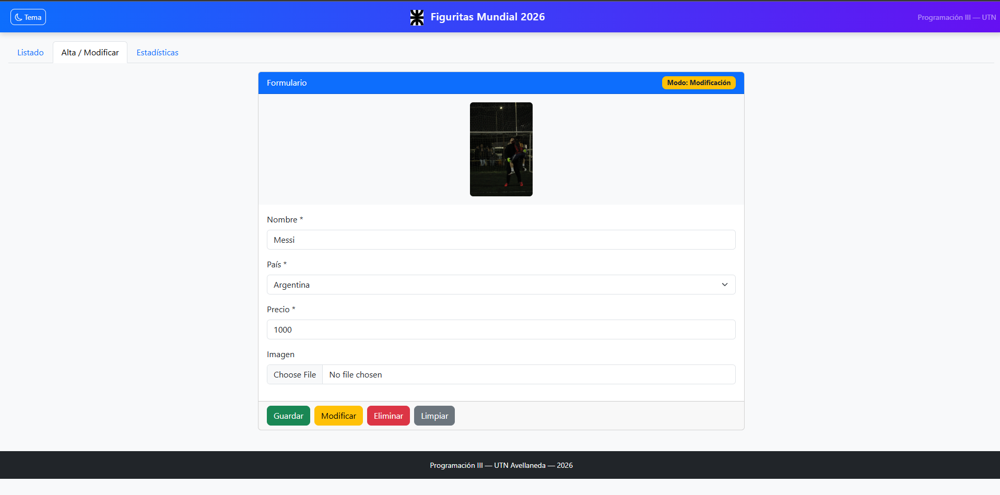
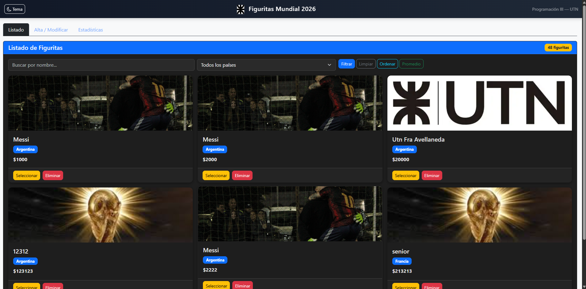

# Figuritas Mundial 2026

## 📌 Descripción
Aplicación web de gestión de figuritas del Mundial 2026. Permite crear, editar, eliminar y listar figuritas consumiendo una API REST. Incluye filtros, paginación, estadísticas, exportación a CSV y modo oscuro con persistencia. Desarrollado con JavaScript, HTML, CSS y Bootstrap.

---

## 🚀 Funcionalidades
- Listado de figuritas desde API
- Alta, edición y eliminación (CRUD)
- Filtros por nombre y país
- Paginación (6 por página)
- Estadísticas (total, promedio, máximo, país más común)
- Exportación de datos a CSV
- Modo oscuro/claro con localStorage
- Validaciones de formulario en tiempo real
- Spinner de carga para peticiones

---

## 🛠 Tecnologías utilizadas
- HTML5
- CSS3
- JavaScript (Vanilla)
- Bootstrap 5
- Bootstrap Icons
- Fetch API

---

## 🎯 Objetivo del proyecto
Proyecto realizado como práctica de consumo de API REST y manejo de CRUD completo en frontend, aplicando validaciones, manipulación del DOM y buenas prácticas de JavaScript.

---

## 📷 Capturas

---

## 📌 Notas
Proyecto desarrollado como parte de la materia Programación III (UTN Avellaneda).